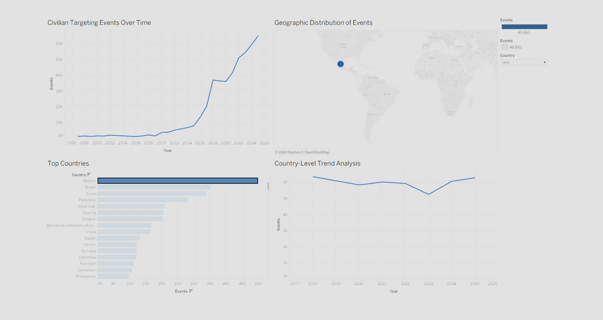

# Global Civilian Targeting Trends (1997–2025)

Interactive Tableau dashboard analyzing global civilian targeting events over time using aggregated ACLED conflict data.



---

## Dashboard Overview

This project visualizes trends in civilian targeting events across multiple countries between 1997 and 2025. The dashboard is designed to support exploratory analysis of long-term political violence patterns, geographic concentration, and conflict escalation trends.

The visualization combines:
- Global geographic mapping
- Time-series trend analysis
- Country-level filtering
- Interactive dashboard exploration

---

## Key Insights

- Civilian targeting events increase significantly after the early 2010s.
- Several countries demonstrate persistent concentrations of civilian targeting activity across multiple decades.
- Later years in the dataset show broader geographic distribution of civilian targeting events.
- Temporal analysis highlights periods of escalation associated with major regional conflicts and insurgencies.

---

## Tools Used

- Tableau Public
- Microsoft Excel
- ACLED Aggregated Conflict Data

---

## Data Source

Data sourced from the Armed Conflict Location & Event Data Project (ACLED).

Source:  
https://acleddata.com/aggregated/number-events-targeting-civilians-country-year

ACLED provides real-time and historical data on political violence, protest activity, and conflict events worldwide.

---

## Dashboard Access

View the interactive dashboard on Tableau Public:

https://public.tableau.com/app/profile/ryan.garcia4428/viz/Civiliantargeteventsbyyearsandcountry/GlobalCivilianTargetingTrends19972025

---

## Methodology

The dashboard uses aggregated ACLED civilian targeting event data grouped by country and year.

Data preparation included:
- Standardization of yearly event totals
- Geographic mapping preparation
- Tableau relationship modeling
- Interactive filtering configuration
- Dashboard layout and visualization design

---

## Project Structure

```text
/acled-civilian-targeting-dashboard
│
├── README.md
├── data/
├── dashboard/
├── images/
│   └── dashboard_preview.png
└── docs/
```

---

## Disclaimer

This project is intended for educational and analytical purposes only.

All conflict data attribution belongs to ACLED.
